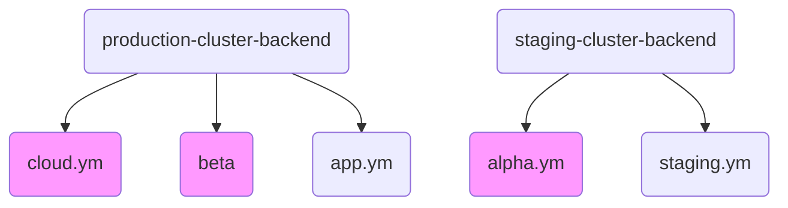

Go is a general-purpose language designed with systems programming in mind. It is 
- strongly typed 
- garbage-collected 
- has explicit support for concurrent programming

Programs are constructed from _packages_, whose properties allow efficient management of dependencies.

The grammar is compact and simple to parse, allowing for easy analysis by automatic tools such as integrated development environments.

Each of the leaves in the graph contain bot development environments. Each bot development environment has three isolated regions -> sandbox, staging and production. 